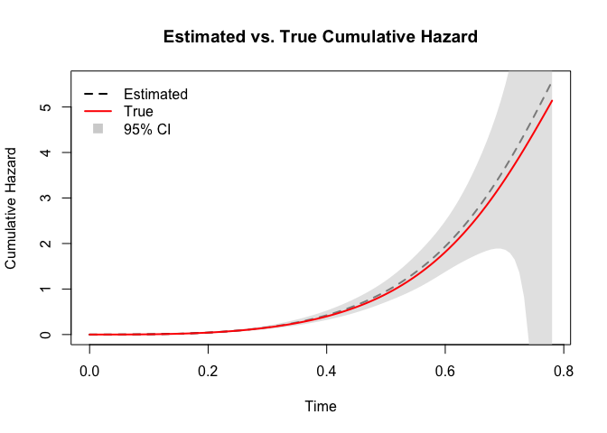

# COLSA

To address collaborative inference for the Cox proportional hazards
model in distributed data settings, we introduce COLSA (Collaborative
Likelihood-based Survival Analysis). COLSA uses basis function expansion
to approximate the baseline hazard and performs sequential updates to
efficiently incorporate distributed data batches. Key features of COLSA
include:

- **Dynamic Basis Expansion:** The number of basis functions is
  adaptively adjusted as new data batches arrive, balancing bias and
  variance.
- **Sequential Model Updates:** COLSA updates the model iteratively with
  each incoming batch, using a pre-estimated Hessian matrix for the
  baseline hazard to reduce bias from previous batches.

## Installation

You can install the development version of COLSA like so:

``` r
pak::pak("signorinoy/COLSA")
```

## Example

``` r
library(COLSA)
```

In the simulation study, we considered two continuous and two
categorical covariates. The continuous covariates were independently
generated from a bivariate normal distribution. The first categorical
covariate was simulated from a Bernoulli distribution, while the second
categorical covariate, comprising four levels, was drawn from a
multinomial distribution whose probability mass function depended on the
levels of the first categorical variable.

Event times were generated from a mixture of Weibull distributions, with
shape parameters 3 and 5 and scale parameters 10 and 20, respectively.
Censoring times followed an exponential distribution with rate parameter
3. The observed event times were subject to right censoring. The true
regression coefficients were set as

$${\mathbf{β}} = (0.15, - 0.15,0.3,0.3,0.3,0.3)^{\top}$$

A total of six datasets were generated: the first three containing 1,500
observations each, and the remaining three containing 500 observations
each. The complete dataset was randomly partitioned into these six
groups.

``` r
head(sim)
#>   id       time status        x1       x2 x31 x42 x43 x44 group
#> 1  1 0.09887412      0 10.958910 5.938538   1   0   0   1     1
#> 2  2 0.05130399      0  7.499272 6.305020   1   1   0   0     1
#> 3  3 0.26820027      1  4.589824 4.250194   1   0   0   1     1
#> 4  4 0.14401458      1  4.528155 5.301456   1   0   1   0     1
#> 5  5 0.24992644      0  5.469901 5.624268   0   0   0   1     1
#> 6  6 0.40221177      1  5.063252 6.157249   1   0   0   1     1
```

The COLSA procedure involves:

1.  **Optimal Basis Selection:** Evaluate the Akaike Information
    Criterion (AIC) across a range of basis function counts and select
    the number that minimizes AIC.
2.  **Initial Model Fitting:** Fit the Cox model to the first data batch
    using the selected basis functions.
3.  **Sequential Updating:** For each subsequent batch: (a) update model
    parameters with the new data; (b) adjust the number of basis
    functions according to the rate $O\left( n^{- 1/5} \right)$, where
    $n$ is the cumulative sample size; (c) pre-estimate the Hessian of
    the baseline hazard to mitigate bias in its estimation.

This procedure enables scalable and communication-efficient survival
analysis under distributed settings while preserving statistical
efficiency.

``` r
formula <- Surv(time, status) ~ x1 + x2 + x31 + x42 + x43 + x44
boundary <- c(0, max(sim$time))

df_sub <- sim[sim$group == 1, , drop = FALSE]

aics <- sapply(seq_len(5), function(n_basis) {
  AIC(colsa(formula, df_sub, n_basis, boundary, scale = 1))
})
n_basis_best <- which.min(aics)
alpha_best <- n_basis_best / nrow(df_sub)^0.2

fit <- colsa(formula, df_sub, n_basis_best, boundary)
for (batch in 2:6) {
  df_sub <- sim[sim$group == batch, , drop = FALSE]
  fit <- update(fit, df_sub, alpha = alpha_best)
}
```

The model updating process continues sequentially through all six data
batches. Upon incorporating data from the 6th site, we obtain the final
model fit. The summary of the fitted COLSA model is shown below:

``` r
summary(fit)
#> Call:
#> update.colsa(object = fit, newdata = df_sub, alpha = alpha_best)
#> 
#> Number of basis functions:  5 
#> 
#>         coef exp(coef)       se      z        p    
#> x1   0.15663   1.16957  0.01016 15.424  < 2e-16 ***
#> x2  -0.17255   0.84152  0.02231 -7.733 1.05e-14 ***
#> x31  0.38273   1.46629  0.05782  6.619 3.61e-11 ***
#> x42  0.27510   1.31666  0.09094  3.025 0.002486 ** 
#> x43  0.29164   1.33862  0.08329  3.502 0.000462 ***
#> x44  0.17682   1.19341  0.08220  2.151 0.031472 *  
#> ---
#> Signif. codes:  0 '***' 0.001 '**' 0.01 '*' 0.05 '.' 0.1 ' ' 1
#>     exp(coef) exp(-coef) lower .95 upper .95
#> x1  1.1696    0.8550     1.1465    1.1931   
#> x2  0.8415    1.1883     0.8055    0.8791   
#> x31 1.4663    0.6820     1.3092    1.6422   
#> x42 1.3167    0.7595     1.1017    1.5736   
#> x43 1.3386    0.7470     1.1370    1.5760   
#> x44 1.1934    0.8379     1.0158    1.4020
```

Once the final COLSA estimate is obtained, we can construct survival
curves for arbitrary covariate values. As a diagnostic step, we plot the
estimated baseline cumulative hazard function and compare it to the true
cumulative hazard function used in the data-generating process.

``` r
df <- basehaz(fit)
df$true <- -log(0.5 * exp(-10 * df$time^3) + 0.5 * exp(-20 * df$time^5))
lower_col <- grep("lower", names(df), value = TRUE)[1]
upper_col <- grep("upper", names(df), value = TRUE)[1]
plot(df$time, df$basehaz,
  type = "l", lwd = 2, lty = 2,
  col = "black",
  xlab = "Time", ylab = "Cumulative Hazard",
  main = "Estimated vs. True Cumulative Hazard"
)
polygon(
  x = c(df$time, rev(df$time)),
  y = c(df[[lower_col]], rev(df[[upper_col]])),
  col = adjustcolor("lightgrey", alpha.f = 0.6),
  border = NA
)
lines(df$time, df$true, col = "red", lwd = 2)
legend("topleft",
  legend = c("Estimated", "True", "95% CI"),
  col = c("black", "red", "lightgrey"), lty = c(2, 1, NA),
  lwd = c(2, 2, NA), pch = c(NA, NA, 15),
  pt.cex = 1.5, bty = "n", inset = 0.02
)
```



The comparison demonstrates that the COLSA method can effectively
recover the true baseline cumulative hazard function, even under
distributed and censored data settings. The shaded region represents the
95% confidence interval of the estimated cumulative hazard function.
